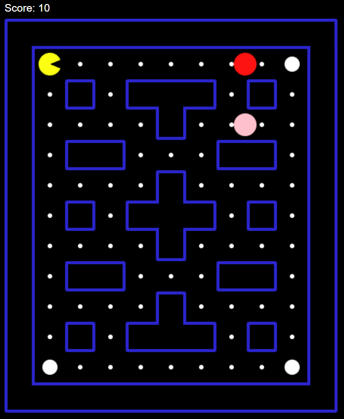

# 🟡 Pac-Man Clone em JavaScript

Este é um projeto de recriação do clássico jogo **Pac-Man**, desenvolvido utilizando **HTML, CSS e JavaScript puro**.  
O objetivo foi praticar conceitos de lógica de programação, manipulação do DOM, estilização e criação de um mini-game interativo no navegador.  

---

## 🎮 Funcionalidades
- Movimentação do Pac-Man pelo teclado (setas ou WASD).  
- Sistema de pontuação ao coletar pontos no mapa.  
- Fantasmas inimigos que perseguem o Pac-Man.  
- Estrutura do labirinto baseada no jogo original.  
- Condições de vitória e derrota.  

---

## 🛠️ Tecnologias utilizadas
- **HTML5** → Estrutura da página.  
- **CSS3** → Estilização do tabuleiro, sprites e cores.  
- **JavaScript (ES6+)** → Lógica do jogo, movimentação, colisões e pontuação.  

---

## 🚀 Como testar o projeto
1. Acesse o link do deploy: [Pacman](https://karathus.github.io/Pacman/)